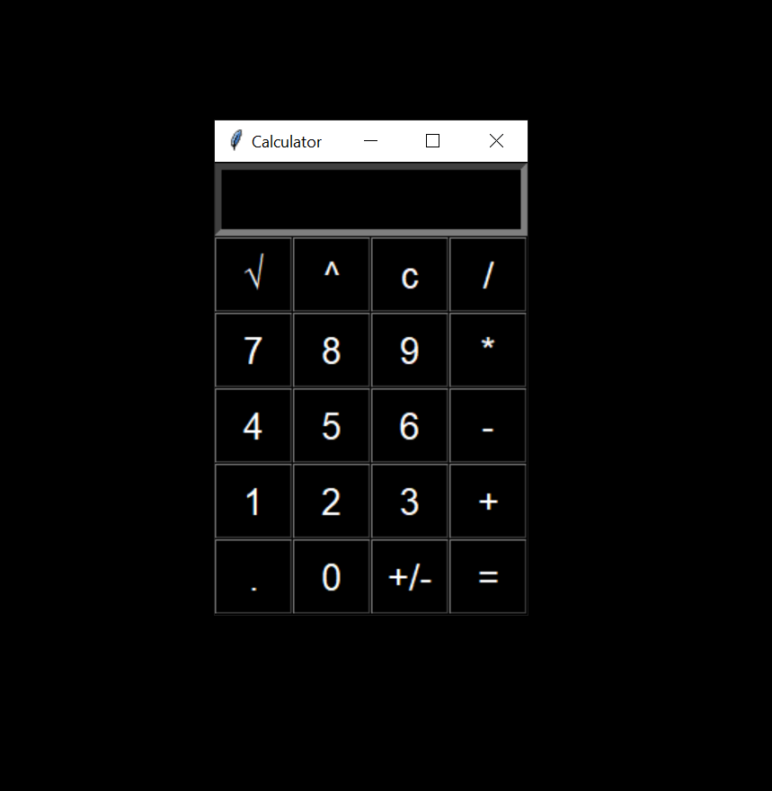

# Simple-GUI-Calculator

### Used Programming Language
- *Python*

Created this app using *tkinter* module

This calculator contains all the features that a simple calculator has, that includes 
- Addition
- Subtraction
- Multiplication
- Division
- Square root
- Power
- Clear Button
- Also, we can change the sign of a number (from +ve to -ve, and vice-versa) during calculation

